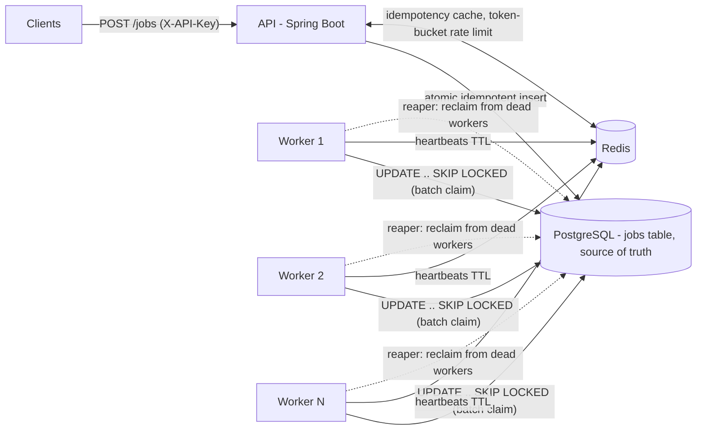

# Forge — Distributed Job Queue

[](https://github.com/JakeIn4K/forge/actions/workflows/ci.yml)

A persistent, distributed job queue with a REST API, built on PostgreSQL's `FOR UPDATE SKIP LOCKED` and Redis. Producers submit jobs over HTTP; horizontally scaled workers claim and execute them; jobs survive crashes, retry with backoff, and dead-letter when hopeless — with the metrics to watch it all happen.

**Live demo:** _URL goes here after deploy — see [docs/DEPLOY.md](docs/DEPLOY.md)_ (free tier: first request after idle takes ~40s to wake)

**Measured** ([methodology](bench/RESULTS.md)): **2,580 submissions/sec** at **p99 12.6ms** · **1,149 jobs/sec** drained across 3 workers · **p99 end-to-end 113ms** · claim query **0.55ms against a 50k backlog**

## Architecture



- **Postgres is the queue.** One atomic `UPDATE … WHERE id IN (SELECT … FOR UPDATE SKIP LOCKED)` claims jobs: ordered by priority and age, no double-processing, no blocking between workers, no broker to operate.
- **Redis is the accelerant, never the truth** — idempotency fast path, per-key token-bucket rate limiting, worker liveness heartbeats. Every Redis failure mode has a reasoned posture (fail open, fail safe) documented in code.
- **At-least-once delivery, honestly.** Failed jobs retry with full-jitter exponential backoff; crashed workers' jobs are reclaimed after their heartbeats expire; `max_attempts` exhaustion dead-letters to an inspectable endpoint. Handlers must be idempotent — exactly-once is not a thing networks offer.
- **Everything observable**: Prometheus metrics (queue depth, claim latency, job durations, retry/dead/reclaim counters) and a per-queue stats endpoint.
- **One artifact, two roles**: the same image is the API or a worker via a Spring profile.

## Design decisions & tradeoffs

<!-- Written by the project owner — see PR notes. Cover: Postgres-as-queue vs
     a broker (Kafka/RabbitMQ), at-least-once + idempotency keys, visibility
     timeout + heartbeats vs alternatives. Three short paragraphs. -->

_This section is being written — landing with the deploy PR._

## Kill a worker, lose nothing

`demo/chaos.sh` enqueues 1,000 jobs across three workers and SIGKILLs one mid-drain:

```
== SIGKILL worker b8c6dd2ecdb2 with jobs in flight
   succeeded=345 in_flight=647 dead=0 / 1000
   succeeded=697 in_flight=295 dead=0 / 1000
   succeeded=997 in_flight=3   dead=0 / 1000   <- the dead worker's orphans
   succeeded=1000 in_flight=0  dead=0 / 1000   <- reclaimed and completed
== PASS: all 1000 jobs succeeded, zero lost, despite a worker dying mid-run
```

The pause at 997 is the design working: the killed worker's in-flight jobs wait out the visibility timeout, its heartbeats expire, and the reaper (running in every surviving worker, safely concurrent via a conditional `UPDATE`) returns them to the queue.

## Benchmarks

| Metric | Baseline | Tuned |
|---|---|---|
| Submission throughput | 2,550 req/s (p99 13.7ms) | 2,584 req/s (p99 12.6ms) |
| Drain throughput (3 workers) | 659 jobs/s | **1,149 jobs/s (+74%)** |
| End-to-end latency p50 / p99 | 483 / 703 ms | **59 / 113 ms** |

Two tuning changes, each a `perf:` commit with before/after in the message: batch claiming (one `SKIP LOCKED` query claims 10 jobs) and a 100ms poll interval (the baseline e2e median *was* the old 500ms interval). One null result kept honestly: doubling the connection pool changed nothing, so it stayed at the default. Full methodology, hardware notes, and the `EXPLAIN ANALYZE` reading in [bench/RESULTS.md](bench/RESULTS.md).

## Quickstart

```sh
cp .env.example .env
docker compose up --build -d --scale worker=3
```

Submit, inspect, watch:

```sh
curl -X POST localhost:8080/api/v1/jobs \
  -H 'X-API-Key: dev-key' -H 'Content-Type: application/json' \
  -d '{"type": "sleep", "payload": {"millis": 2000}, "idempotencyKey": "demo-42"}'

curl -H 'X-API-Key: dev-key' localhost:8080/api/v1/jobs/<id>

curl -H 'X-API-Key: dev-key' localhost:8080/api/v1/queues/default/stats
```

Same `idempotencyKey` twice → the original job back (200, not 201). Delayed jobs via `runAt`, priorities via `priority`, dead letters at `/api/v1/queues/{q}/dead`, metrics at `/actuator/prometheus`.

## Development

JDK 21 + Maven: `mvn verify` (tests run against real Postgres + Redis via Testcontainers). Load tests: `k6 run bench/submit.js`.

## What I'd do next

- **LISTEN/NOTIFY** to replace polling — buys near-zero idle latency at the cost of long-lived connection management (the 100ms poll got 7x cheaply; this is the principled next step).
- **Kafka comparison as scale demands it** — Postgres-as-queue has a throughput ceiling; the honest answer to "what breaks at 100x" is partitioning the hot table or moving the claim path to a log-based broker.
- **Leader-elected reaper** — every-worker reaping is safe but redundant; a Redis-lock election would cut duplicate scans.
- **Kubernetes** — compose is enough to demo; k8s manifests (probes already exist) would be the production packaging.
